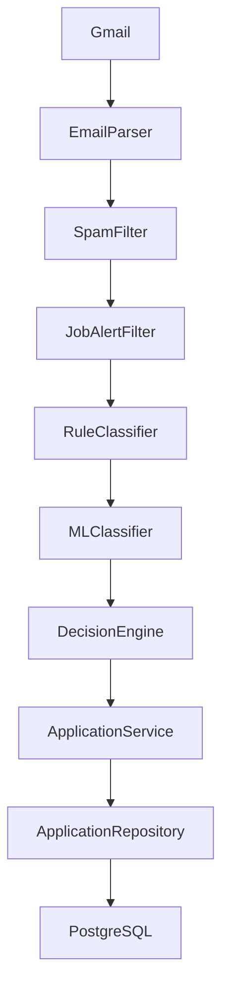

# Tracker

## Current Progre&#x20;d)

Tracker has been refactored from a monolithic email processor into a layered backend architecture focused on scalability and maintainability.

### ✅ Completed

#### Architecture

- Layered backend architecture
- Separation of concerns using Services, Repositories, Matchers, and Pipeline
- Business logic removed from API routes

#### Gmail Integration

- Gmail OAuth 2.0
- Automatic token refresh
- Paginated email synchronization
- Duplicate email prevention
- Robust error handling

#### Email Processing Pipeline

- HTML email parsing
- Spam filtering
- Job alert filtering
- Rule-based classification
- ML fallback (TF-IDF + Logistic Regression)
- Decision engine for confidence handling

#### Application Layer

- Application Repository
- Application Matcher (Thread ID based)
- Application Service
- PipelineResult abstraction

#### Database

- PostgreSQL with Async SQLAlchemy
- Application persistence
- Confidence tracking
- Classification method tracking
- Review flag support

---

## Current Pipeline

---

## Current Limitations

- Company extraction not implemented
- Role extraction not implemented
- Application timeline not implemented
- Existing applications matched only by Gmail Thread ID
- Classification accuracy depends ality and extracted text

---

## Next Milestone (Sprint 3)

- Improve HTML/Text extraction
- Email type detection
- Company & role extraction
- Smarter application matching
- Timeline-based application tracking
